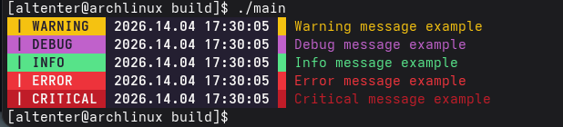

# 🚀 Console Logger (C++)

A lightweight asynchronous console logger for C++ with colored output.

---

## 📌 Overview

`ConsoleLogger` is a simple thread-safe logging library for C++.

You just call `log()`, and the logger takes care of everything else —  
queueing, formatting, and printing messages in a separate thread.

---

## ✨ Features

- 🧵 Asynchronous logging (worker thread)
- 📥 Thread-safe message queue
- 🎨 Colored output (ANSI escape codes)
- ⏱️ Timestamp formatting
- ⚡ Minimal API (just one method)

---

## 🖼️ Example Output



---

## 📦 Integration

### 1. Clone the repository

```bash
git clone https://github.com/alt-enterssx/console_logger.git
```
### 2. Add to your project (CMake)

```cmake
add_subdirectory(console_logger)

target_link_libraries(your_project PRIVATE altenter::console_logger)
```

### 3. Include header

```cpp
#include "altenter/console_logger.h"
```

## ⚙️ How It Works
`log() → queue → worker thread → console output`

## 📊 Log Types
```cpp
enum LogType {
    WARGNING,
    DEBUG,
    INFO,
    ERROR,
    CRITICAL
};
```
